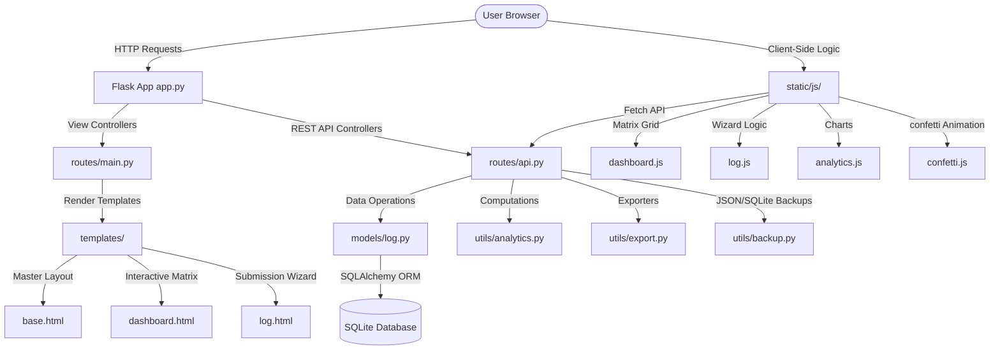

# LifeTrack: Technical Developer Guide

Welcome to the LifeTrack Developer Guide. This document provides a walkthrough of the LifeTrack codebase, ranging from basic database setup and Flask routing to advanced algorithmic implementations, Canvas-based physics engines, and custom document exporters.

This guide is designed for developers who want to understand the inner workings of the application and learn how to maintain, debug, and extend it.

---

## 🗺️ Project Architecture & Data Flow

LifeTrack is built as a modular, offline-first Web application. It uses a Model-View-Controller (MVC) style structure implemented via Flask blueprints and Python utility modules.

### High-Level Architecture


### Core Technologies
- **Backend Framework**: Flask (version 3.0.3)
- **Database Layer**: SQLite with Flask-SQLAlchemy ORM
- **Exporting Suite**: `openpyxl` (styled Excel sheets) and `ReportLab` (formatted PDF documents)
- **Frontend Core**: Vanilla JavaScript (ES6) and custom Glassmorphic CSS styled over Bootstrap 5
- **Visuals**: Chart.js (Dark theme config) and HTML5 Canvas

---

## 🗂️ Detailed Directory Map

Click any file to jump directly into the source code:

- [app.py](app.py): Application factory configuration, directory setup, database creation, and automatic browser launcher.
- [database/connection.py](database/connection.py): Instantiates the SQLAlchemy engine.
- [models/log.py](models/log.py): The database model `DailyLog` describing habit columns, qualitative notes, and serialization.
- [routes/main.py](routes/main.py): Registers routes serving HTML templates (Dashboard, log form, analytics, reports, settings).
- [routes/api.py](routes/api.py): REST API endpoints for submissions, backup transfers, grid updates, and exports.
- [utils/analytics.py](utils/analytics.py): Houses mathematical computations for streaks, chart datasets, and monthly reports.
- [utils/backup.py](utils/backup.py): Implements file system database cloning and JSON import/export routines.
- [utils/export.py](utils/export.py): Builds structured output formats (CSV, Excel sheets, and PDF report cards).
- [static/css/style.css](static/css/style.css): The CSS custom variables, layout systems, glassmorphism templates, and animations.
- [static/js/main.js](static/js/main.js): Toast popup alerts system.
- [static/js/confetti.js](static/js/confetti.js): Local canvas element manager running particle animations.
- [static/js/log.js](static/js/log.js): Form progress steps and answer validation logic.
- [static/js/dashboard.js](static/js/dashboard.js): Calendar cell alignment and modal renderer.
- [static/js/analytics.js](static/js/analytics.js): Instantiates Chart.js graphs inside dark mode.

---

## 🟢 Basic Concepts: Backend Foundation & Routing

### 1. Database Model Setup
The database contains a single table `daily_logs` represented by the class `DailyLog` in `models/log.py`.

- **Date Unique Constraint**: The `date` column is marked `unique=True` and acts as the unique business key for each ledger entry. This ensures only one entry can exist per calendar day.
- **Tracked Categories**: Five categories are defined:
  - `q1_val` (Study)
  - `q2_val` (Projects)
  - `q3_val` (Exercise)
  - `q4_val` (Career)
  - `q5_val` (Avoid Social Media)
- Each category has a boolean column (`_val`) and a corresponding text column (`_note`) for user descriptions.
- **Computed Indicators**:
  - `score`: The sum of all active habits on that day (0 to 5).
  - `completed`: Set to `True` only if the daily score is exactly 5.

```python
# models/log.py
class DailyLog(db.Model):
    __tablename__ = 'daily_logs'
    id = db.Column(db.Integer, primary_key=True)
    date = db.Column(db.Date, unique=True, nullable=False, index=True)
    q1_val = db.Column(db.Boolean, nullable=False, default=False)
    q1_note = db.Column(db.Text, nullable=True)
    # ... q2_val to q5_val fields
    score = db.Column(db.Integer, nullable=False, default=0)
    completed = db.Column(db.Boolean, nullable=False, default=False)
```

### 2. View Controllers & Blueprint Routing
Flask routes are divided into two distinct blueprints:
1. **Main Blueprint (`routes/main.py`)**: Handles page requests. When a user requests a URL, the view controller retrieves stats (using `get_dashboard_metrics()`) and passes them directly to Jinja2 HTML templates.
2. **API Blueprint (`routes/api.py`)**: Exposes REST interfaces returning structured JSON payloads for frontend requests, export endpoints, backups, and developer debug actions.

---

## 🟡 Intermediate Concepts: Interactive Interfaces

### 1. Form Wizard Step Management
The habit-logging page (`templates/log.html`) is built around an interactive form wizard managed by `static/js/log.js`.

- Instead of submitting a long form, users answer one question at a time.
- The script locks the progress unless the user selects either the **Yes** or **No** button for the current question.
- **Q5 Exclusion**: For Q5 ("Did you waste time..."), selecting **No** triggers a positive value (`true` state in database) because avoiding the distraction is the desired outcome.

### 2. Calendar Grid Construction
The dashboard calendar displays a rolling 30-day block. The grid is constructed dynamically in `static/js/dashboard.js`:

1. It fetches dates and logging status (completed, partial, missed, pending) from the endpoint `/api/calendar-days`.
2. It aligns the dates by day of the week by computing an offset based on the oldest element:
   ```javascript
   const firstDayObj = new Date(days[0].date);
   let firstDayOfWeek = firstDayObj.getDay() - 1; // convert Sun-Sat (0-6) to Mon-Sun (0-6)
   if (firstDayOfWeek === -1) firstDayOfWeek = 6;
   // Render empty grid cells to pad the offset
   ```
3. Custom CSS classes apply varying color indicators: green (completed), yellow (partial), red (missed), and blue-gray (pending).
4. **Grid Sizing & Overlap Mitigation**: In `static/css/style.css`, the columns are set explicitly to `repeat(7, 24px)` with a `6px` gap. Weekday headers ("Mon", "Tue") and cells are set to a width of `24px`. This prevents overlapping text wrapping bugs and makes the cells easy to click.

### 3. Live Date Widget
A dynamic system session calendar widget displays the current date:
- **Location**: In the sidebar (`templates/base.html`) directly below the brand logo.
- **Layout & Hover States**: Styled inside `static/css/style.css` under `.sidebar-datetime`. It utilizes glassmorphic styling, standardizing fonts at `9.5px` and centering them. On hover, the color transitions from cyan (`--secondary-accent`) to white (`--text-main`).
- **Date Formatting**: Scripted in `static/js/main.js` inside `updateDate()`, producing a formatted string like `25 Jul Sat` using client-side JavaScript date APIs.
- **Update Frequency**: Refreshes on page load and runs on a 30-second passive interval timer (`setInterval`) to ensure rollover updates if left open across days, while avoiding unnecessary ticking rendering cycles.
- **Responsiveness**: Hidden on smaller viewport sizes (`max-width: 768px`) to keep bottom-nav controls uncluttered on mobile devices.

---

## 🔴 Advanced Concepts: Calculations & Custom Modules

### 1. Habit Streak Algorithm
Streaks are computed in the `get_streak_stats` function inside `utils/analytics.py`:

#### Longest Streak
1. Fetch all logged entries where `completed=True` (perfect days) sorted chronologically.
2. Iterate through dates. If a date is exactly 1 day after the previous date, increment `current_temp`. If there is a gap, compare `current_temp` with `longest_streak` and reset `current_temp` to 1.
3. Keep track of the maximum value encountered.

#### Current Streak
1. Check if a perfect day exists for **today**. If yes, begin counting backward using a loop.
2. If not, check if a perfect day exists for **yesterday** (allowing the user to finish their current day before breaking the streak). If yes, begin counting backward.
3. If neither contains a perfect record, the current streak is reset to 0.

```python
# utils/analytics.py
today = datetime.date(datetime.now())
yesterday = today - timedelta(days=1)

current_streak = 0
if today in completed_dates:
    current_streak = 1
    check_date = today - timedelta(days=1)
    while check_date in completed_dates:
        current_streak += 1
        check_date -= timedelta(days=1)
# ... repeat check for yesterday
```

### 2. Confetti Particle System
The confetti animation is written in pure vanilla JS using Canvas API (`static/js/confetti.js`):

- A temporary `<canvas>` element is appended dynamically to the `<body>` on a fixed coordinate overlay.
- It instantiates a collection of `ConfettiParticle` objects, each with a randomized size, color, speed vectors (`vx`, `vy`), and angular rotation.
- **Physics loops**:
  - `vx` drifts based on a sine-wave mathematical model (`this.vx += Math.sin(this.y / 30) * 0.05`) simulating local wind draft.
  - Particles fade out gently as they approach the viewport height (`this.opacity -= 0.015`).
- The system uses `requestAnimationFrame` for smooth rendering and removes the canvas element from the DOM once the timer expires to free up memory.

### 3. ReportLab PDF Generation
The PDF export code in `export_pdf` (`utils/export.py`) constructs formatted layouts using ReportLab Flowables:

- It defines a `SimpleDocTemplate` page size and layout margins.
- It establishes a list structure `story` where structural elements are appended in sequence.
- **Layout styling table**: A styled grid containing consistency percentages, daily scores, and current/longest streak stats is constructed. `TableStyle` commands define backgrounds, borders, grid colors, and vertical alignment:
  ```python
  metric_table.setStyle(TableStyle([
      ('BACKGROUND', (0,0), (-1,-1), colors.HexColor('#F8FAFC')),
      ('BOX', (0,0), (-1,-1), 1, colors.HexColor('#E2E8F0')),
      ('INNERGRID', (0,0), (-1,-1), 0.5, colors.HexColor('#E2E8F0')),
  ]))
  ```
- **Text wrap safety**: Column widths are defined explicitly, and cell content is wrapped inside a `Paragraph` flowable to prevent overflow issues on long text notes.
- **Page Break Control**: Recommendations are wrapped in a `KeepTogether` flowable to prevent them from splitting across pages.

---

## 🛠️ Extension Guide: Adding a New Category

To help you understand how the system fits together, here is a walkthrough for adding a 6th tracked category, **"Read Books"** (`q6`).

### Step 1: Update Database Model
Open `models/log.py` and add the fields for `q6` and update `to_dict()`:

```python
# models/log.py (Inside DailyLog class)
q6_val = db.Column(db.Boolean, nullable=False, default=False)
q6_note = db.Column(db.Text, nullable=True)

# Inside to_dict() method
'q6_val': self.q6_val,
'q6_note': self.q6_note or '',
```

### Step 2: Update API Form Submission
Open `routes/api.py`. Update the submission parser and calculation range:

```python
# routes/api.py (Inside submit_log())
q6_val = bool(data.get('q6_val', False))
q6_note = data.get('q6_note', '').strip()

# Adjust score calculation (Score range shifts from 0-5 to 0-6)
score = sum([q1_val, q2_val, q3_val, q4_val, q5_val, q6_val])
completed = (score == 6) # Perfect day check

# Include in database model instantiation
log = DailyLog(
    # ... q1 to q5 variables
    q6_val=q6_val,
    q6_note=q6_note,
    score=score,
    completed=completed
)
```

### Step 3: Update Questionnaire UI Wizard
1. **Add HTML Step**: In `templates/log.html`, insert a step card inside `<form id="wizard-form">`:
   ```html
   <div class="wizard-step" data-step="6">
       <span class="badge bg-secondary mb-2 text-uppercase">Question 6 of 6</span>
       <h3 class="fw-bold mb-3">Did you read books today?</h3>
       <div class="option-btn-group">
           <button type="button" class="option-btn" data-q="q6" data-val="yes">Yes</button>
           <button type="button" class="option-btn" data-q="q6" data-val="no">No</button>
       </div>
       <textarea class="custom-textarea" rows="3" data-q="q6" placeholder="What did you read?"></textarea>
   </div>
   ```
2. **Adjust JavaScript State**: In `static/js/log.js`, update the state object and validation counters:
   ```javascript
   const answers = {
       // ... q1 to q5 keys
       q6_val: null, q6_note: ''
   };
   ```

### Step 4: Update Dashboard Modal Details
In `static/js/dashboard.js`, add the 6th item to the array rendering detailed modals:

```javascript
// Inside renderModalDetails()
const questions = [
    // ... q1_val to q5_val items
    { key: 'q6', text: 'Read books today', val: logData.q6_val, note: logData.q6_note }
];
```

### Step 5: Update Analytics Calculations
1. **Daily score charts scaling**: In `static/js/analytics.js`, update line graphs and weekday bar charts to set maximum y-axis scales to `6` instead of `5`.
2. **Analytics data parsing**: Update `get_analytics_data` in `utils/analytics.py` to calculate `q6` completion percentage and pass it to Chart.js.
3. **Monthly Report Audit**: In `generate_monthly_report` in `utils/analytics.py`, add recommendations for `q6` if consistency falls below target rates.

### Step 6: Update Document Exporters
Update `utils/export.py` to write the new category:
- Add `'Read Books'` and `'Read Books Notes'` header elements to Excel spreadsheet tables.
- Add columns to CSV writes.
- Adjust ReportLab table column widths inside `export_pdf` in `utils/export.py` to support the additional column structure cleanly.
